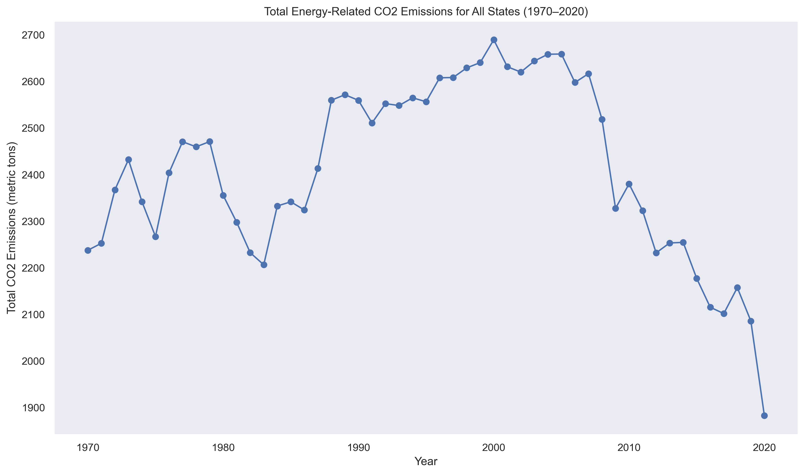

# Trends in Carbon Emissions in USA 

## Summary
The project aims to look at carbon emissions in USA across all of its States. The aim is to determine carbon emissions per capita, mapping out the top 5 States that are responsible for carbon emissions. After that, I am interested to look at carbon emissions through the Electricity Power Generation sector as it is a significant source of carbon emissions in the USA. In particular I want to map out the trends wih regards to using coal, natural gas and petroleum to produce electricity and then show the decline in coal powered electricity emissions across the years while it gets substituted by natural gas.
Essentially the project is a useful starting point for policymakers to understand the state of carbon emissions in USA

## Methodology
My methodology essentially involved extracting excel files from EIA's website. In particular I first downloaded a file that had a total breakdown of carbon emissions per capita across all US States while also giving a breakdown of coal, natural gas and electricity emissions. After that I individually looked at excel files tha just focused on coal, natural gas and electricity. I merged all three of these into a dataset to map out trends. Finally I had to download each State's excel file which provided information on carbon emissions through various sectors such as transportation, residential and electricity. I had to clean the dataset on python to just look at electricity emissions and then combined all the electricity emissions and its breakdown for all states into one dataset. I finally calculated total % of electricity generation through coal, natural gas and petroleum products.
Essentially my major outputs are various graphs that include linegraphs, heatmaps and boxplots to show the trends related to overall emissions and electricity generation emissions.

## Scripts

Once all the data has been gathered and the excel files have been put in one directory, I created one python script which is called emissions.data.py

## Outputs 

My script is able to produce the following outputs:

This shows average emissions per individual across USA from the years 1970 - 2020

This tells us electricity emissions of all sttates in the USA from 1970 - 2020

This is a major figure of the study that illustrates how over the years, there has been a shift in relying on coal and it is being replaced by natural gas especially after 2006

We then looked at top 5 states that have the highest level of per capita emissions as well as the top 10 states

It was also interesting to observe the total CO2 emission trends across USA (1970 - 2020)

We also looked at the trends in just the electricity sector and made a line graph to show those trends

## Results

Ultimately my analysis of the data portrays a decisive shift in electricity production from coal to natural gas over the years. It is also intersting to note how the total carbon emissions have been steadily decreasing, particularly after 2006. Subsequently, this trend indicates a significant shift and mindset change in the energy sector as we see considerations related to the environment being taken seriously, given that natural gas burns more cleanly and produces fewer emissions than coal. However it would be interesting to observe whether this shift was primarily pushed due to environmental concerns?

If we look at this from the perspective of policy-makers then we witness that these findings underline the importance of continued support for cleaner energy sources. In my opinion, policy-makers regardless of party affiliation should be encouraged by this trend and should continue to investigate and allocate resources for policies that facilitate the transition away from fossil fuels, particularly coal, to cleaner alternatives like natural gas, and ultimately, to renewable energy sources. However my analysis was mostly on the electricity generation sector, it would be interesting to see how fossil fuels will be substited in the other sectors.

Additionally, the trend also highlights the potential need for policies to manage this transition in a way that minimizes potential environmental consequences, particularly in regions heavily dependent on coal production.

At the same time my findings also shed light on the total emissions from all sectors, illustrating that certain states have higher per capita emissions than others. Specifically, Wyoming, North Dakota, Alaska, West Virginia, and Louisiana have the highest per capita total emissions. More research will be required on my end to understand the exact reasons why these States have the highest amount of emissions per capita!

It is quite possible and this is just my hypothesis at this point that these states, which have high per capita emissions, likely have economies that are heavily dependent on industries with high carbon footprints, such as mining, oil and gas extraction, and manufacturing. TUltimately, these states would be ideal candidates for policies aimed at promoting a transition to cleaner industries and technologies.

Finally, while the shift to natural gas has contributed to a decrease in emissions, it's a stark reminder to understand that natural gas is still a fossil fuel. As such, the ultimate goal should be a transition towards renewable and zero-emission energy sources. 

