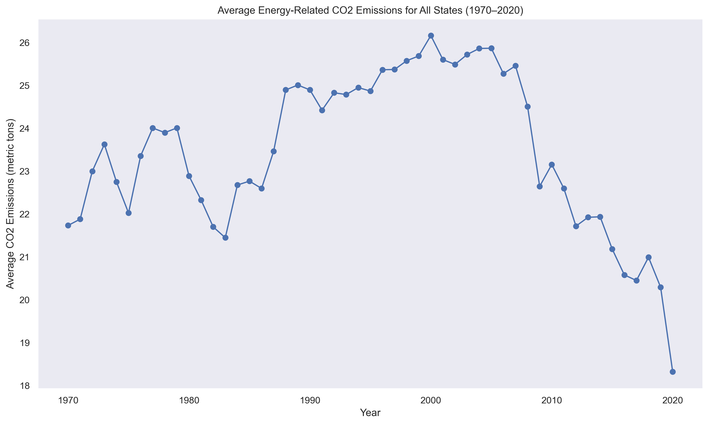
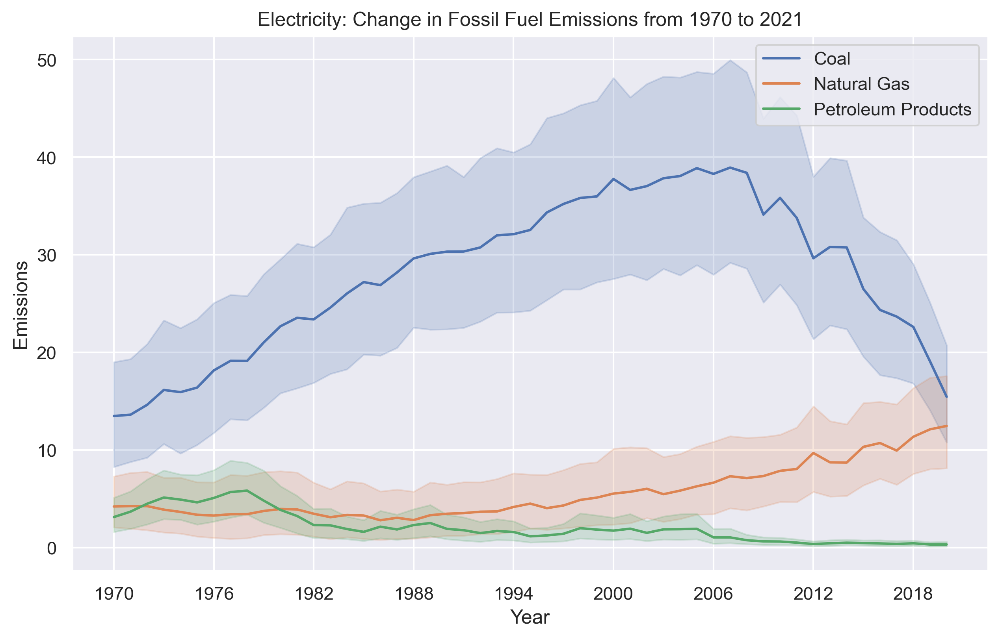
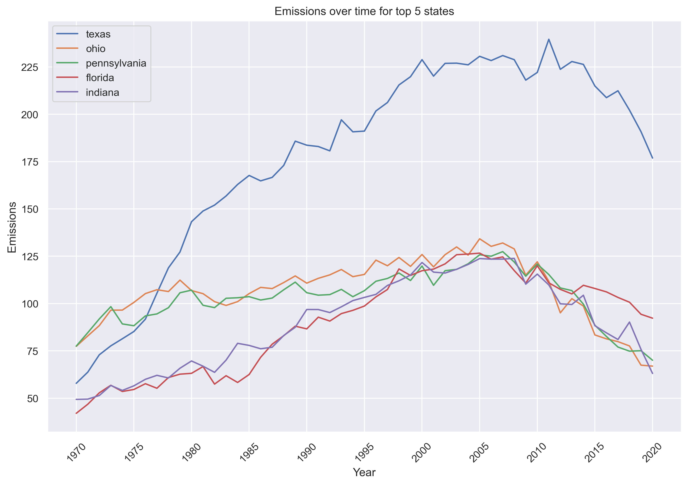
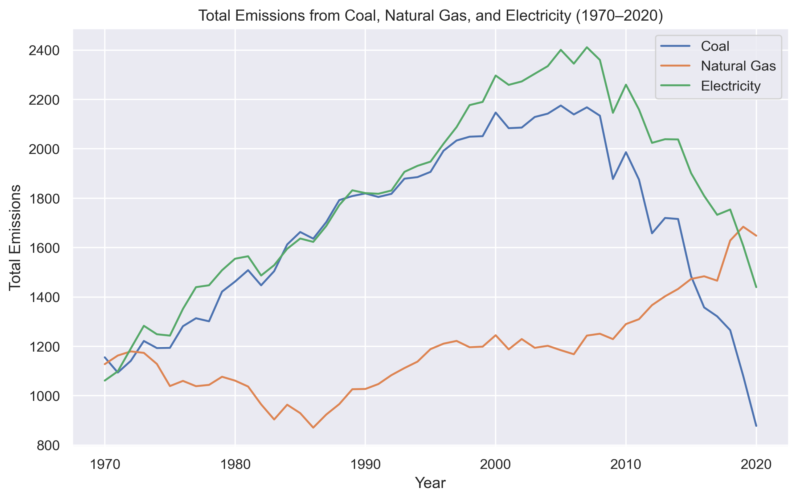
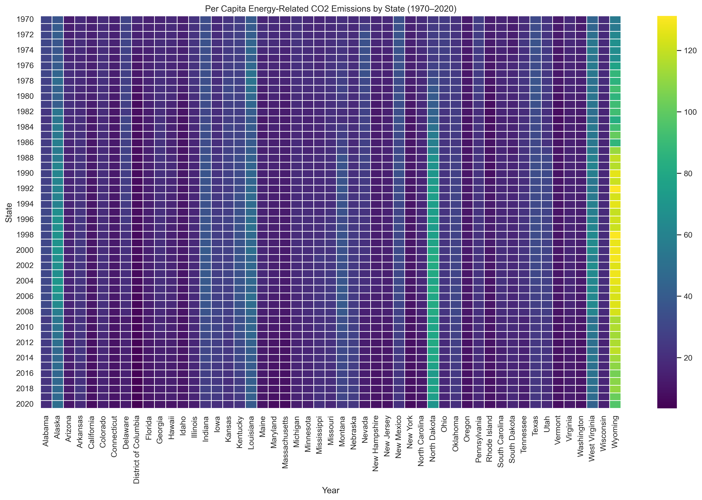
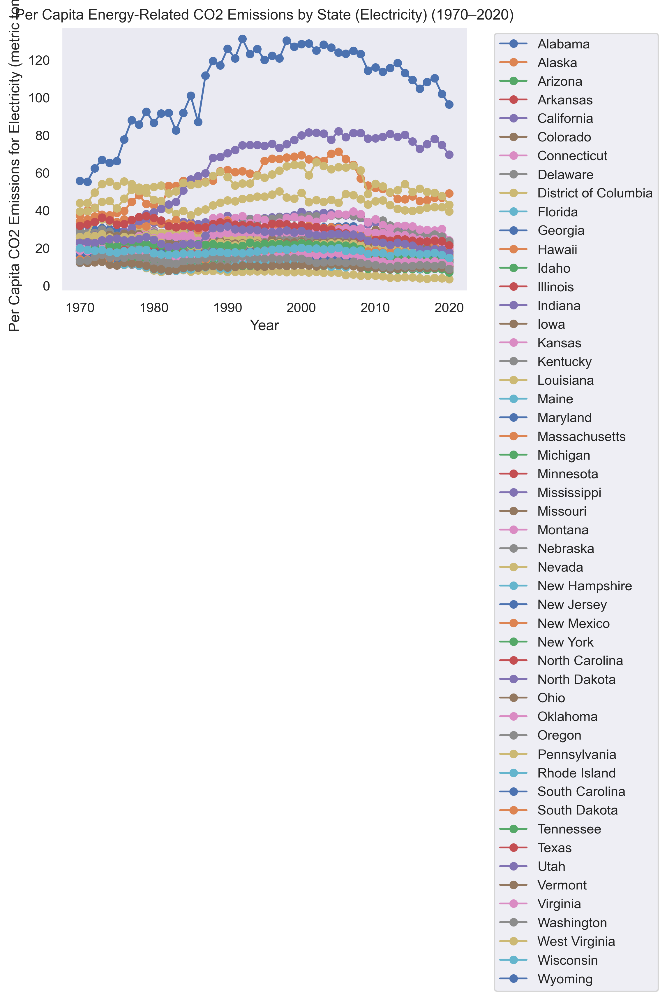
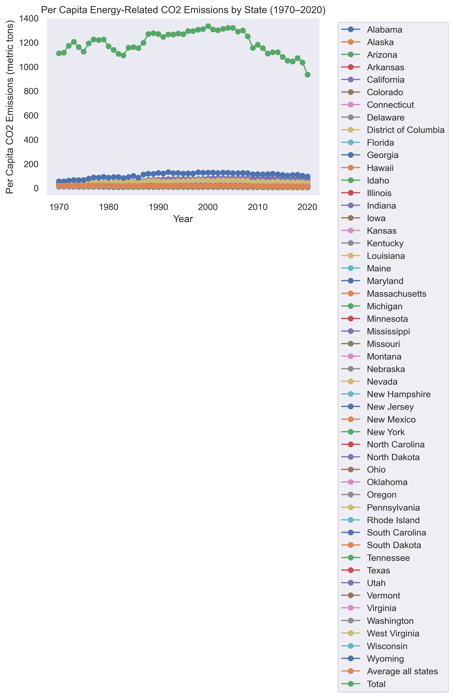
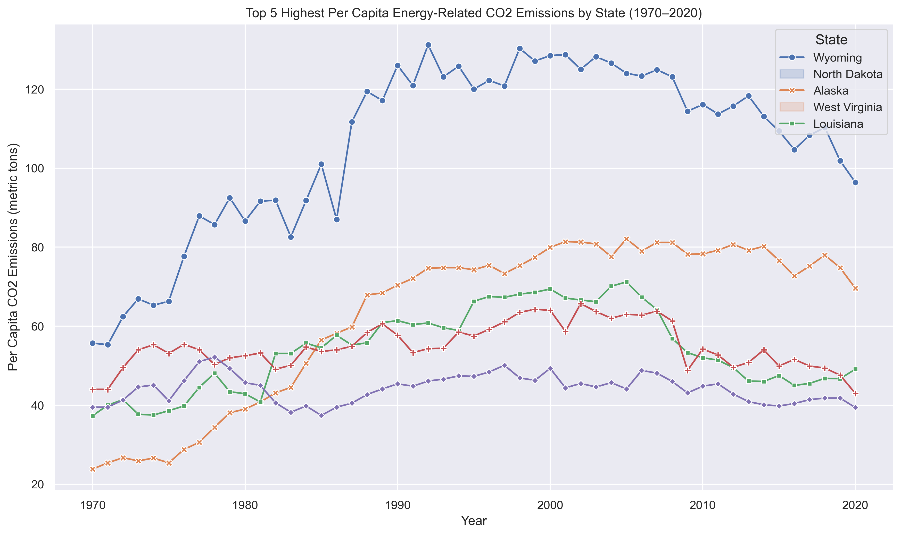
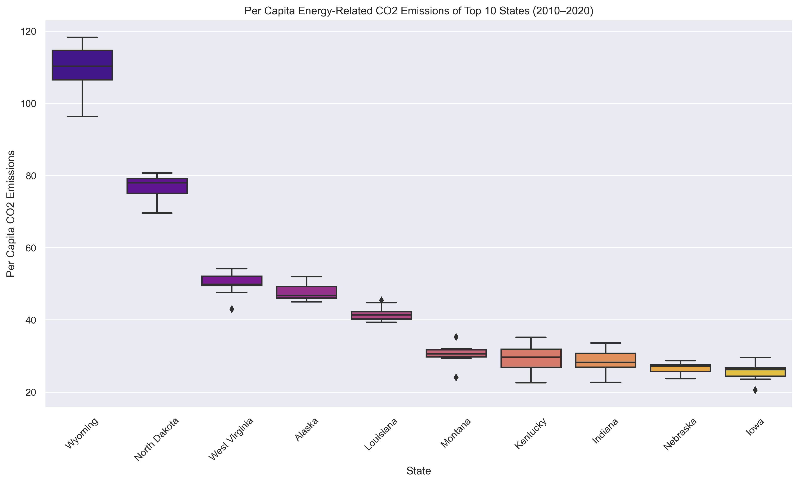
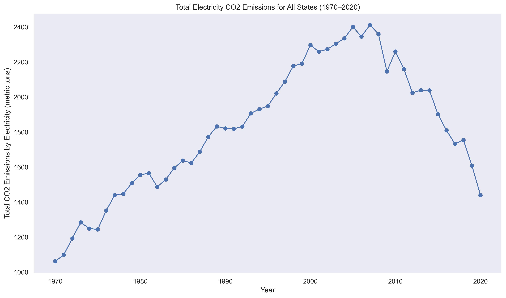

# -*- coding: utf-8 -*-
"""
Created on Fri May 12 20:11:36 2023

@author: snaee
"""

#Trends in Carbon Emissions in USA 

##Summary
The project aims to look at carbon emissions in USA across all of its States. The aim is to determine carbon emissions per capita, mapping out the top 5 States that are responsible for carbon emissions. After that, I am interested to look at carbon emissions through the Electricity Power Generation sector as it is a significant source of carbon emissions in the USA. In particular I want to map out the trends wih regards to using coal, natural gas and petroleum to produce electricity and then show the decline in coal powered electricity emissions across the years while it gets substituted by natural gas.
Essentially the project is a useful starting point for policymakers to understand the state of carbon emissions in USA

##Methodology
My methodology essentially involved extracting excel files from EIA's website. In particular I first downloaded a file that had a total breakdown of carbon emissions per capita across all US States while also giving a breakdown of coal, natural gas and electricity emissions. After that I individually looked at excel files tha just focused on coal, natural gas and electricity. I merged all three of these into a dataset to map out trends. Finally I had to download each State's excel file which provided information on carbon emissions through various sectors such as transportation, residential and electricity. I had to clean the dataset on python to just look at electricity emissions and then combined all the electricity emissions and its breakdown for all states into one dataset. I finally calculated total % of electricity generation through coal, natural gas and petroleum products.
Essentially my major outputs are various graphs that include linegraphs, heatmaps and boxplots to show the trends related to overall emissions and electricity generation emissions.

##Scripts

Once all the data has been gathered and the excel files have been put in one directory, I created one python script which is called emissions.data.py

##Outputs 

My script is able to produce the following outputs:

This shows average emissions per individual across USA from the years 1970 - 2020

This tells us electricity emissions of all sttates in the USA from 1970 - 2020

This is a major figure of the study that illustrates how over the years, there has been a shift in relying on coal and it is being replaced by natural gas especially after 2006

We then looked at top 5 states that have the highest level of per capita emissions as well as the top 10 states

We also looked at the trends in just the electricity sector and made a line graph to show those trends

##Results

The purpose of my analysis was to map out trends of carbon emissions and then specifically looking at the electricity generation sector.

It is interesting that average per capita emissions has fallen in the past decade compared to the years preceding that. Carbon emissions were at its zenith during the 90s but there has been a steady decline ever since.

I looked at the electricity generation sector and it was interesting to note that there has been a significant decrease in reliance on coal powered electricity as its percentage has declined across States while there has been an increase in electricity production through natural gas.

In the future, I would like to see whether that decline has been due to a switch in electricity generation sector which switched relying on coal and increased its reliance on natural gas.

#